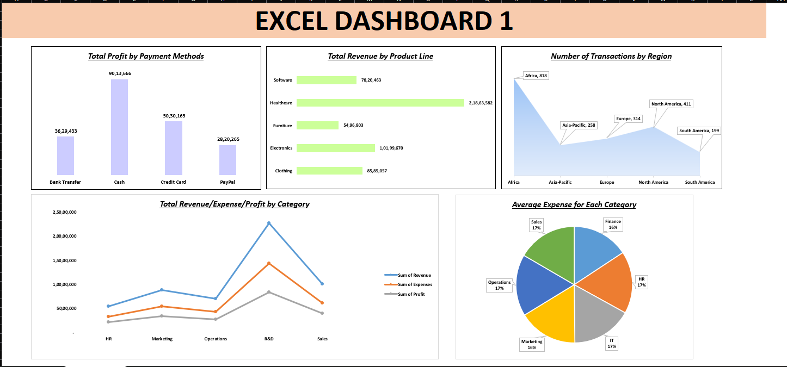

# 📊 Excel Dashboard – Sales/Business Performance Analysis

## 📝 Project Overview
This project features a dynamic Excel dashboard designed to visualize and analyze business performance metrics. It is built using pivot tables, charts, slicers, and conditional formatting to provide interactive insights for decision-makers.

## 📁 Files Included
- **Excel Dashboard 1.xlsx** – Main dashboard file containing raw data, pivot tables, and interactive visualizations.

## 🔧 Tools & Features Used
- Microsoft Excel (Advanced)
  - Pivot Tables & Pivot Charts
  - Data Validation & Slicers
  - Conditional Formatting
  - Dynamic Ranges & Named Ranges
  - Dashboard Design Principles

## 📌 Key Insights
- Interactive overview of performance across regions/products/time
- KPI tracking with visual indicators
- Drill-down into sales by category and subcategory
- Trend analysis for key metrics

## 🎯 Objective
To create an easy-to-use and visually appealing dashboard in Excel that supports real-time business decision-making without the need for programming tools.

## 📸 Screenshots
*Include screenshots of your dashboard here. Upload them to the repository and link them like below:*
```markdown

